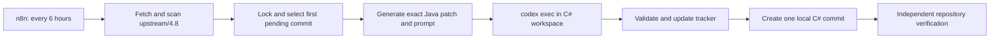

# Automated Java-to-C# upstream porting

n8n is only the scheduler. Repository scripts discover and order Java commits, build the saved prompt, invoke Codex CLI, enforce the one-commit contract, and verify the result.



There is no n8n AI node and no model prompt stored in n8n. The workflow runs `scripts/upstream/run-next-port.ps1`, which reads the versioned prompt from `docs/prompts/port-upstream-commit.md` and passes the generated prompt to `codex exec` over standard input.

## Repository components

| Path | Purpose |
|---|---|
| `scripts/upstream/scan-upstream.ps1` | Fetch Java `upstream/4.8`, list merged commits in order, and report open PRs separately. |
| `scripts/upstream/prepare-next.ps1` | Require clean single-`main` state and package the first pending commit. |
| `scripts/upstream/run-next-port.ps1` | Own the lock, invoke Codex, and enforce exactly one verified C# commit. |
| `scripts/upstream/validate-port.ps1` | Run diff checks, restore, warning rebuild, tests, and fidelity checks. |
| `scripts/upstream/complete-port.ps1` | Record the decision and generate the commit message and trailers. |
| `scripts/upstream/verify-port.ps1` | Verify clean state, history, trailers, ledger, and cursor mappings. |
| `docs/upstream-port-state.json` | Durable Java queue cursor. |
| `docs/upstream-port-log.md` | Java-to-C# decision ledger. |
| `docs/prompts/port-upstream-commit.md` | Versioned Codex instructions. |
| `automation/n8n/workflows/upstream-monitor.json` | Inactive importable scheduler workflow. |

Generated patches, prompts, reports, and Codex logs are ignored below `artifacts/upstream/`.

## Docker boundary

The custom image contains the pinned n8n, Codex CLI, PowerShell, .NET SDK, Git, Python, and repository test tools. Docker Compose mounts:

- the Windows C# checkout at `/workspace/csharp` with write access;
- the Windows Java checkout at `/workspace/java` so the scanner can update remote refs;
- persistent named volumes for n8n state, Codex authentication, and NuGet packages.

Codex runs with `/workspace/csharp` as its working directory and the `workspace-write` sandbox. The Java checkout is outside that writable workspace. n8n's Execute Command node still has container-level access to both mounts, so the service is bound only to `127.0.0.1` and must not be exposed publicly.

The container matches Git for Windows `core.autocrlf=true`; otherwise Linux Git would incorrectly report most mounted CRLF files as modified.
Before its warning-baseline rebuild, it removes only generated `*.Up2Date` markers. Host-created markers appear as root-owned through Docker Desktop, so .NET cannot update their explicit timestamps as the non-root container user. MSBuild recreates them; source files and substantive outputs are untouched.

## First-time setup

Prerequisites are Docker Desktop using Linux containers, PowerShell 7.2 or newer, and sibling checkouts at:

```text
C:\Users\ryanf\Documents\GitHub\BeyondAionSharp
C:\Users\ryanf\Documents\GitHub\aion-server
```

Different locations, timezone, commit identity, host port, or Codex model can be set by copying `automation/n8n/.env.example` to `automation/n8n/.env` and editing the values.

1. Build and start the container from the C# repository:

   ```powershell
   pwsh -NoProfile -File .\scripts\automation\start-n8n.ps1
   ```

2. Open the URL printed by the launcher and create the local n8n owner account.

3. Authenticate Codex inside its persistent Docker volume:

   ```powershell
   pwsh -NoProfile -File .\scripts\automation\login-codex.ps1
   ```

   Follow the displayed device-auth URL and code. Rebuilding the image does not remove this login; `docker compose down --volumes` does.

4. Import or refresh the inactive workflow:

   ```powershell
   pwsh -NoProfile -File .\scripts\automation\import-workflow.ps1
   ```

5. In n8n, open **BeyondAionSharp - Port Java commits with Codex** and run it manually once. Confirm the final result is expected and inspect `git status` afterward.

6. Publish or activate the workflow. It then runs every six hours and handles at most one merged Java commit per execution.

The C# repository must be clean, on `main`, and contain no other local branches before a pending commit can run. Untracked files count as dirty.

## Scheduled lifecycle

Each n8n execution performs two commands:

1. `scan-upstream.ps1` fetches Java `upstream/4.8`, calculates the merged queue after `lastCompletedJavaCommit`, and reads the open-PR watchlist. Open PRs are never eligible until their commits are reachable from `upstream/4.8`.
2. `run-next-port.ps1 -NoFetch` processes only the first pending merged commit under an exclusive filesystem lock.

For a pending commit, the runner:

1. refuses a dirty C# worktree, a branch other than `main`, or additional local branches;
2. creates the patch, metadata, prompt, and baseline fingerprints;
3. invokes noninteractive Codex CLI with no approval prompts and a three-hour timeout;
4. lets the versioned prompt direct implementation, tests, tracker completion, and the local commit;
5. independently requires a clean worktree, exactly one descendant commit, valid trailers, a matching ledger decision, and a valid queue cursor;
6. writes machine-readable and human-readable logs below the commit's artifact directory.

Codex never pushes. BeyondAionSharp currently has no Git remote, and the prompt explicitly forbids remotes, branches, pull requests, merges, and history rewriting.

## Result states

| Status | Meaning | Automatic next run |
|---|---|---|
| `no-pending` | No merged Java commit follows the cursor. | Scan again later. |
| `busy` | Another run owns `artifacts/upstream/automation.lock`. | Try again later. |
| `committed` | One port decision was committed and verified. | Process the next commit on a later run. |
| `blocked` | Codex committed an evidence-based blocked tracker decision. | Stop at this Java SHA. |
| `blocked-existing` | The first pending SHA already has a blocked ledger row. | Do not retry automatically. |
| `codex-not-authenticated` | The persistent Codex volume has no valid login. | n8n execution fails; run the login script. |
| `codex-failed` / `codex-timeout` | Codex exited unsuccessfully or exceeded its timeout. | n8n execution fails; inspect the worktree. |
| `failed` | A safety, preparation, or postcondition check failed. | n8n execution fails; inspect the reported reason. |

A failed Codex run may deliberately leave partial edits for inspection. The next pending run will refuse that dirty tree, preventing it from mixing commits. Review those edits and either finish the same port manually or remove only the automation-created changes before retrying.

## Manual operation and recovery

Run the exact same worker without waiting for n8n:

```powershell
docker compose --project-name beyond-aion-automation `
  --file .\automation\n8n\docker-compose.yml `
  exec -T n8n pwsh -NoProfile -File /workspace/csharp/scripts/upstream/run-next-port.ps1 `
  -CSharpRepository /workspace/csharp -JavaRepository /workspace/java -OutputFormat Text
```

After resolving the prerequisite for a blocked SHA, use the same command with `-RetryBlocked`. The scheduler intentionally does not retry blocked decisions on its own.

Inspect a run with:

```powershell
git status --short --branch
Get-Content .\artifacts\upstream\latest-run.json
Get-ChildItem .\artifacts\upstream -Recurse -Filter runner-result.json
docker compose --project-name beyond-aion-automation `
  --file .\automation\n8n\docker-compose.yml logs --tail 200 n8n
```

Per-commit directories also contain `prompt.md`, `commit.patch`, `metadata.json`, `codex-events.jsonl`, `codex-final.md`, and `codex-process.log` when Codex was invoked.

Stop the service without deleting persistent state:

```powershell
pwsh -NoProfile -File .\scripts\automation\stop-n8n.ps1
```

## Maintenance

Runtime versions are pinned as Docker build arguments in `automation/n8n/docker-compose.yml`. Update them deliberately, rebuild, rerun `scripts/upstream/test-upstream-automation.ps1` in the container, import the workflow again, and perform a manual run before reactivating scheduling.

The n8n and Codex volumes contain the owner configuration and login credentials. Back them up if this automation becomes operationally important, keep the n8n port local, and never commit `automation/n8n/.env`.

Official references: [Codex noninteractive mode](https://learn.chatgpt.com/docs/non-interactive-mode.md), [Codex authentication](https://learn.chatgpt.com/docs/auth.md), [n8n with Docker](https://docs.n8n.io/deploy/host-n8n/install-options/install-with-docker/), [n8n Execute Command](https://docs.n8n.io/integrations/builtin/core-nodes/n8n-nodes-base.executecommand/), and [n8n workflow import/export](https://docs.n8n.io/workflows/export-import/).
